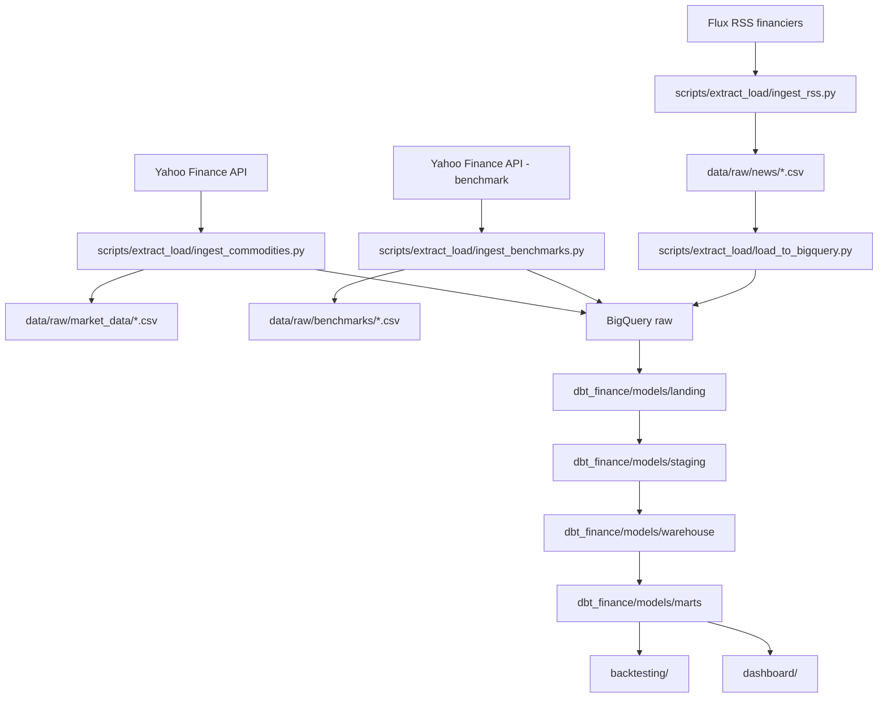

# Flux de la donnée

Ce document explique le trajet de la donnée dans le projet, depuis les sources externes jusqu'au dashboard Streamlit.

L'objectif est d'avoir un pipeline lisible :

```text
Sources externes
→ scripts d'extraction
→ fichiers locaux temporaires
→ BigQuery raw
→ transformations dbt
→ BigQuery marts
→ backtesting et dashboard Streamlit
```

---

## 1. Vue d'ensemble



> Les fichiers CSV dans `data/raw/` servent de zone tampon locale. Ils sont pratiques pour déboguer, rejouer une ingestion et vérifier les données avant chargement. L'arborescence `data/` est suivie via des `.gitkeep`, mais son contenu runtime est ignoré par Git.

---

## 2. Dossiers importants

| Dossier | Rôle |
| --- | --- |
| `config/` | Contient les paramètres du pipeline : tickers, benchmarks, RSS, stratégies. |
| `scripts/extract_load/` | Contient les scripts d'extraction et de chargement des données brutes. |
| `scripts/nlp/` | Contient les scripts d'embeddings, pertinence, sentiment et indicateurs textuels. |
| `data/raw/` | Zone locale temporaire pour les CSV extraits depuis les APIs ; contenu ignoré par Git. |
| `data/processed/` | Zone locale temporaire pour les fichiers nettoyés ou enrichis ; contenu ignoré par Git. |
| `dbt_finance/` | Projet dbt qui transforme les tables BigQuery. |
| `backtesting/` | Moteur de backtesting consommant les tables mart. |
| `dashboard/` | Application Streamlit consommant les tables mart. |
| `logs/` | Logs locaux du pipeline et erreurs ; contenu ignoré par Git. |

---

## 3. Flux données de marché

### 3.1 Configuration

Les matières premières et tickers sont définis dans :

```text
config/commodities.yml
```

Exemple attendu :

```yaml
commodities:
  - symbol: GC=F
    name: Gold Futures
    category: precious_metals
  - symbol: CL=F
    name: Crude Oil WTI Futures
    category: energy
```

### 3.2 Extraction depuis Yahoo Finance

Script responsable :

```text
scripts/extract_load/ingest_commodities.py
```

Rôle du script :

1. lire `config/commodities.yml` ;
2. conserver par défaut uniquement les commodities avec `enabled: true` ;
3. appliquer les filtres optionnels `--priorities` ou `--symbols` si demandés ;
4. appeler l'API Yahoo Finance avec `yfinance` ;
5. récupérer les champs OHLCV ;
6. normaliser les noms de colonnes ;
7. ajouter `symbol`, `source` et `ingested_at` ;
8. écrire un CSV local dans `data/raw/market_data/` ;
9. charger les lignes dans BigQuery `raw.market_data_raw`.

Le fichier `config/commodities.yml` contient actuellement 20 actifs configurés et activés (`enabled: true`). Le run standard tente donc de charger les 20 actifs, sauf si un filtre `--priorities` ou `--symbols` est fourni.

Commande de vérification sans appel API :

```bash
python3 scripts/extract_load/ingest_commodities.py --dry-run --priorities A B
```

Commande pour voir l'univers complet. L'option `--include-disabled` reste utile si certains actifs sont redésactivés plus tard :

```bash
python3 scripts/extract_load/ingest_commodities.py --dry-run --include-disabled
```

Commande d'ingestion :

```bash
python3 scripts/extract_load/ingest_commodities.py --priorities A B
```

Commande pour charger aussi d'éventuels actifs marqués `enabled: false` si la configuration évolue :

```bash
python3 scripts/extract_load/ingest_commodities.py --include-disabled
```

Cette commande écrit d'abord les CSV locaux, puis charge directement les données dans BigQuery. Par défaut, elle démarre à `settings.pipeline.start_date` et utilise la date du jour comme `end_date` Yahoo Finance. Comme `yfinance` traite `end` comme une borne exclusive, cela revient à charger l'historique jusqu'à J-1.

Commande d'ingestion incrémentale quotidienne :

```bash
python3 scripts/extract_load/ingest_commodities.py --priorities A B --incremental
```

Avec `--incremental`, le script lit `MAX(date)` dans `raw.market_data_raw`, repart au jour suivant, puis charge en mode `merge`.

Si Yahoo Finance échoue temporairement, il est possible de préserver le dernier état local valide :

```bash
python3 scripts/extract_load/ingest_commodities.py --priorities A B --use-local-fallback
```

Dans ce mode, le script réutilise le dernier fichier `data/raw/market_data/market_data_YYYYMMDD.csv` disponible au lieu de produire un état vide.

Pour tester uniquement l'écriture locale sans charger BigQuery :

```bash
python3 scripts/extract_load/ingest_commodities.py --priorities A B --skip-bigquery
```

Fichier produit :

```text
data/raw/market_data/market_data_YYYYMMDD.csv
```

Fichiers complémentaires :

```text
data/raw/market_data/commodities_reference_YYYYMMDD.csv
data/raw/market_data/market_data_errors_YYYYMMDD.csv
```

Le fichier d'erreurs n'est créé que si au moins un ticker échoue ou ne retourne aucune donnée.

Schéma attendu :

```text
symbol
date
open
high
low
close
adjusted_close
volume
source
ingested_at
```

### 3.3 Chargement vers BigQuery

Le chargement BigQuery est fait directement par :

```text
scripts/extract_load/ingest_commodities.py
```

Rôle du script :

1. écrire le CSV local pour audit et rejouabilité ;
2. préparer le DataFrame au schéma BigQuery ;
3. créer la table `raw.market_data_raw` si elle n'existe pas ;
4. charger les lignes dans une table temporaire ;
5. fusionner les données avec un `MERGE` sur `symbol` + `date` ;
6. éviter les doublons lors d'une relance.

Table BigQuery cible :

```text
raw.market_data_raw
```

Modes d'écriture disponibles :

```bash
python3 scripts/extract_load/ingest_commodities.py --write-disposition merge
python3 scripts/extract_load/ingest_commodities.py --write-disposition append
python3 scripts/extract_load/ingest_commodities.py --write-disposition truncate
```

Le mode recommandé est `merge`, car il rend la relance idempotente sur le couple `symbol` + `date`.

---

## 4. Flux benchmarks

Un benchmark est une référence de comparaison.

Dans ce projet, il ne sert pas à prendre une décision d'achat ou de vente. Il sert à répondre à une question simple :

> Est-ce que ma stratégie fait mieux qu'une méthode de référence simple ?

Il y a trois familles de benchmarks dans le projet :

| Benchmark | Rôle | Exemple |
| --- | --- | --- |
| Buy and Hold | Acheter une matière première au début de la période et la garder jusqu'à la fin. | Acheter `GC=F` en 2020 et conserver jusqu'à J-1. |
| Synthetic Index | Construire une référence interne sur le panier de matières premières du projet. | Un indice équipondéré mensuel sur les instruments `A` et `B`. |
| Benchmark global externe | Représenter le marché global des matières premières avec un proxy investissable. | ETF diversifié comme `DBC`. |

Exemple :

```text
Si une stratégie sur l'or gagne +18 %, mais que Buy and Hold sur l'or gagne +25 %,
alors la stratégie est moins intéressante que simplement acheter et conserver l'or.

Si une stratégie gagne +18 %, mais que le benchmark global commodities gagne +8 %,
alors elle surperforme le marché global des matières premières.
```

Le benchmark est donc une base de comparaison, pas une source de signal.

### 4.1 Validation métier

Le fichier `scripts/extract_load/commodity_benchmark_index.py` contient une logique intéressante métier, mais il faut bien distinguer ce qui est valide pour le projet et ce qui reste une approximation.

| Élément | Validation métier | Limite à documenter |
| --- | --- | --- |
| Buy and Hold par matière première | Très pertinent : c'est la baseline minimale. Une stratégie active doit être comparée à “acheter et conserver” le même instrument. | Ne tient pas compte des frais réels, de la marge futures ou du roulement de contrats. |
| Synthetic Commodity Index | Pertinent comme benchmark interne : il mesure la performance d'un panier comparable à l'univers étudié. | Ce n'est pas un indice officiel investissable. Il utilise les séries continues Yahoo Finance, donc il simplifie le roll futures, le collatéral et les multiplicateurs. |
| Global External `DBC` | Pertinent comme proxy externe diversifié et compréhensible. | `DBC` est un ETF avec sa propre méthodologie, ses frais et son univers ; il ne correspond pas forcément exactement aux matières premières du projet. |

La bonne lecture est donc :

```text
Buy and Hold
→ comparaison instrument par instrument

Synthetic Commodity Index
→ comparaison contre l'univers interne du projet

Global External DBC
→ comparaison contre un proxy externe du marché commodities
```

Le choix métier est cohérent pour un MVP de backtesting, à condition d'écrire clairement que le synthetic index est un benchmark de recherche, pas un indice financier réplicable à l'identique.

### 4.2 Configuration

Les benchmarks sont définis dans :

```text
config/benchmarks.yml
```

Exemple attendu :

```yaml
benchmarks:
  global_external:
    benchmark_id: global_dbc
    benchmark_type: global_external
    symbol: DBC
    name: Invesco DB Commodity Index Tracking Fund

  buy_and_hold:
    enabled: true
    benchmark_id_prefix: buy_hold
    base_value: 100

  synthetic_index:
    enabled: true
    benchmark_id: synthetic_commodity_index
    weighting: equal
    rebalance: monthly
    base_value: 100
```

Dans cet exemple :

- `global_external` charge `DBC` comme proxy externe ;
- `buy_and_hold` crée un benchmark passif par matière première ;
- `synthetic_index` crée un indice interne à partir des matières premières sélectionnées.

### 4.3 Extraction et calcul

Script responsable :

```text
scripts/extract_load/ingest_benchmarks.py
```

Rôle du script :

1. lire `config/benchmarks.yml` ;
2. lire les matières premières activées dans `config/commodities.yml` ;
3. récupérer les prix via Yahoo Finance ou depuis un CSV `market_data_YYYYMMDD.csv` ;
4. aligner les dates, fréquences et colonnes avec les données de marché ;
5. calculer les benchmarks Buy and Hold ;
6. calculer le Synthetic Commodity Index via `commodity_benchmark_index.py` ;
7. récupérer le benchmark global externe `DBC` si activé ;
8. écrire un CSV local ;
9. charger directement les lignes dans BigQuery `raw.benchmarks_raw`.

Fichier produit :

```text
data/raw/benchmarks/benchmarks_YYYYMMDD.csv
```

Exemple de contenu :

```csv
date,benchmark_id,benchmark_type,benchmark_name,component_id,component_symbol,close_price,benchmark_level,daily_return,actual_weight,source
2024-01-02,buy_hold_gold,buy_and_hold,Buy & Hold Gold Futures,GOLD,GC=F,2078.40,100.00,,,
2024-01-03,buy_hold_gold,buy_and_hold,Buy & Hold Gold Futures,GOLD,GC=F,2055.70,98.91,-0.0109,,yahoo_finance
2024-01-03,synthetic_commodity_index,synthetic_index,Synthetic Commodity Index,GOLD,GC=F,2055.70,99.42,-0.0058,0.50,yahoo_finance
2024-01-03,global_dbc,global_external,Invesco DB Commodity Index Tracking Fund,GLOBAL,DBC,22.18,99.69,-0.0031,,yahoo_finance
```

Schéma attendu :

```text
date
benchmark_id
benchmark_type
benchmark_name
component_id
component_symbol
component_name
category
priority
close_price
benchmark_level
daily_return
drawdown
actual_weight
target_weight
rebalance_executed
source
methodology
ingested_at
```

Différence avec `market_data_raw` :

- `market_data_raw` contient les prix des instruments étudiés pour générer indicateurs et signaux ;
- `benchmarks_raw` contient les niveaux d'indices et poids des références utilisées pour comparer les résultats ;
- une même matière première peut apparaître dans les deux logiques : comme instrument tradé dans `market_data_raw`, et comme référence Buy and Hold dans `benchmarks_raw`.

Commandes utiles :

```bash
python3 scripts/extract_load/ingest_benchmarks.py --dry-run
python3 scripts/extract_load/ingest_benchmarks.py --priorities A B
python3 scripts/extract_load/ingest_benchmarks.py --priorities A B --incremental
python3 scripts/extract_load/ingest_benchmarks.py --input-market-csv data/raw/market_data/market_data_YYYYMMDD.csv --skip-global-external
python3 scripts/extract_load/ingest_benchmarks.py --priorities A B --skip-bigquery
```

La commande avec `--input-market-csv` est utile pour éviter de retélécharger les mêmes prix que `ingest_commodities.py`.

Le script contrôle aussi la couverture minimale des prix par composant avant de calculer l'indice synthétique. Par défaut, chaque composant doit avoir au moins 80 % de valeurs non nulles :

```bash
python3 scripts/extract_load/ingest_benchmarks.py --priorities A B --min-coverage-ratio 0.80
```

### 4.4 Chargement vers BigQuery

Script responsable :

```text
scripts/extract_load/ingest_benchmarks.py
```

Table BigQuery cible :

```text
raw.benchmarks_raw
```

Le script crée la table si elle n'existe pas, partitionne par `date`, clusterise par `benchmark_id` et `benchmark_type`, puis charge les données. Le mode recommandé est `merge`, car il rend la relance idempotente sur :

```text
date + benchmark_id + component_id
```

Utilisation après chargement :

```text
raw.benchmarks_raw
→ stg_benchmarks
→ int_tradable_assets
→ int_technical_indicators
→ int_strategy_signals
→ mart_strategy_metrics
→ dashboard Backtest Lab
```

Le backtesting utilise ensuite ces données pour calculer :

- la performance du benchmark sur la même période ;
- la surperformance ou sous-performance de la stratégie ;
- les graphiques de comparaison entre stratégie, Buy and Hold et benchmark global.

Depuis la dernière version du projet, le `synthetic_commodity_index` est aussi exposé comme actif backtestable sous le symbole :

```text
COMMODITY_INDEX
```

Il est construit dans `int_tradable_assets` à partir de `stg_benchmarks`, puis passe dans les mêmes calculs d'indicateurs, signaux, rendements et métriques que les autres actifs. Cela permet de tester une stratégie sur le panier commodities global du projet, et pas seulement sur un contrat isolé.

---

## 5. Flux actualités RSS

### 5.1 Configuration

Les flux RSS sont définis dans :

```text
config/rss_sources.yml
```

Exemple attendu :

```yaml
rss_sources:
  - source_id: investing_commodities
    feed_id: investing_commodities_news
    name: Investing.com - Commodities & Futures News
    source_name: Investing.com Commodities
    url: https://www.investing.com/rss/news_11.rss
    category: commodities_news
    priority: 2
    quality: high
    requires_deduplication: true
    enabled: true
```

Les cinq sources retenues pour le MVP sont :

| Source | Rôle |
| --- | --- |
| S&P Global Commodity Insights | Qualité institutionnelle, conservée en référence mais désactivée par défaut car les flux répondent `403 Forbidden` sans accès/API S&P. |
| Investing.com Commodities | Volume d'articles, analyses et sentiment de marché. |
| Barchart Commodity News | Futures, grains, metals, energy et soft commodities. |
| CME Group RSS | Contexte futures pour CME/CBOT/NYMEX/COMEX. |
| Nasdaq Commodities | Complément généraliste et contexte macro commodities. |

### 5.2 Extraction RSS

Script responsable :

```text
scripts/extract_load/ingest_rss.py
```

Rôle du script :

1. lire `config/rss_sources.yml` ;
2. appeler chaque flux RSS avec `requests` ;
3. parser chaque réponse avec `feedparser` ;
4. récupérer titre, source, URL, date et résumé/contenu disponible ;
5. nettoyer le HTML avec BeautifulSoup ;
6. normaliser les URLs en supprimant les paramètres de tracking ;
7. calculer `article_id`, `content_hash` et `raw_content_hash` ;
8. supprimer les doublons exacts par `article_id` et `content_hash` ;
9. écrire un CSV local ;
10. charger directement les articles dans BigQuery `raw.news_raw`.

Fichier produit :

```text
data/raw/news/news_YYYYMMDD.csv
```

Schéma attendu :

```text
article_id
title
source
url
published_at
clean_text
content_hash
ingested_at
```

Schéma complet chargé dans BigQuery :

```text
article_id
source_id
feed_id
source
feed_name
category
language
priority
quality
title
url
canonical_url
published_at
summary
clean_text
content_hash
raw_content_hash
fetched_at
ingested_at
```

Commandes utiles :

```bash
python3 scripts/extract_load/ingest_rss.py --dry-run
python3 scripts/extract_load/ingest_rss.py --source-ids investing_commodities barchart_commodities
python3 scripts/extract_load/ingest_rss.py --feed-ids investing_commodities_news --skip-bigquery
```

### 5.3 Chargement vers BigQuery

Script responsable :

```text
scripts/extract_load/ingest_rss.py
```

Table BigQuery cible :

```text
raw.news_raw
```

Le script crée la table si elle n'existe pas, partitionne par `published_at`, clusterise par `source_id` et `category`, puis charge les données. Le mode recommandé est `merge`, car il rend la relance idempotente sur :

```text
article_id
```

Les erreurs par flux sont écrites localement dans :

```text
data/raw/news/news_errors_YYYYMMDD.csv
```

---

## 6. Flux NLP

Les données textuelles chargées dans BigQuery sont ensuite enrichies par les scripts NLP.

Point important : **FinBERT et les embeddings ne sont pas calculés directement dans dbt**.

dbt est excellent pour transformer des tables avec du SQL : nettoyer, typer, joindre, dédupliquer, agréger. En revanche, charger un modèle NLP comme FinBERT ou Sentence Transformers est un traitement Python.

Dans ce projet, la séparation recommandée est donc :

| Étape | Outil | Rôle |
| --- | --- | --- |
| Nettoyage simple des articles | dbt Staging | Préparer `stg_news` depuis `raw.news_raw`. |
| Embeddings | Python | Charger Sentence Transformers et écrire les vecteurs. |
| Sentiment FinBERT | Python | Charger FinBERT et calculer les probabilités positive, neutre, négative. |
| Pertinence article-matière première | Python | Comparer les embeddings article et commodity. |
| Agrégation finale | dbt Warehouse | Construire les indicateurs journaliers par matière première. |
| Exposition dashboard/backtesting | dbt Marts | Produire les tables finales propres. |

Le flux recommandé est donc hybride :

```text
raw.news_raw
→ dbt staging : stg_news
→ scripts Python NLP lisent stg_news
→ scripts Python NLP écrivent des tables raw NLP
→ dbt warehouse lit ces tables raw NLP
→ dbt marts expose les résultats
```

Pourquoi ne pas écrire directement dans `dbt_finance` ou `mart` depuis Python ?

- pour garder dbt responsable des tables transformées ;
- pour éviter que Python et dbt modifient les mêmes tables ;
- pour conserver une séparation claire entre résultats bruts de modèles et tables métier ;
- pour pouvoir rejouer dbt sans relancer FinBERT à chaque fois.

Les scripts Python NLP écrivent donc plutôt dans des tables brutes ou semi-brutes :

```text
raw.news_embeddings_raw
raw.news_sentiment_raw
raw.article_commodity_relevance_raw
raw.news_features_raw
```

Puis dbt construit les modèles :

```text
stg_news_embeddings
stg_news_sentiment
stg_article_commodity_relevance
int_commodity_news_features
mart_dashboard_overview
mart_strategy_signals
```

### 6.1 Embeddings

Script responsable :

```text
scripts/nlp/create_embeddings.py
```

Entrée :

```text
stg_news
```

Sortie possible :

```text
raw.news_embeddings_raw
```

Rôle du script :

1. lire les articles nettoyés sans embedding depuis `stg_news` ;
2. générer un vecteur avec le modèle défini dans `.env` ;
3. historiser le modèle et sa version ;
4. éviter de recalculer les embeddings déjà présents.

Dans l'implémentation actuelle, le script peut aussi lire directement un CSV local `news_YYYYMMDD.csv` pour tester sans BigQuery :

```bash
python3 scripts/nlp/create_embeddings.py --input-news-csv data/raw/news/news_YYYYMMDD.csv --mock-embeddings --skip-bigquery
python3 scripts/nlp/create_embeddings.py --input-news-csv data/raw/news/news_YYYYMMDD.csv
```

Le modèle par défaut est défini dans `config/settings.yml` :

```text
sentence-transformers/all-MiniLM-L6-v2
```

Schéma attendu :

```text
article_id
embedding
embedding_dimension
embedding_model
embedding_version
created_at
```

### 6.2 Pertinence article-matière première

Script responsable :

```text
scripts/nlp/compute_relevance.py
```

Entrées :

```text
raw.news_embeddings_raw
config/commodities.yml
```

Sortie possible :

```text
raw.article_commodity_relevance_raw
```

Rôle du script :

1. créer une description de référence par matière première ;
2. générer ou charger son embedding ;
3. comparer chaque article à chaque matière première ;
4. calculer une similarité cosinus ;
5. appliquer un seuil de pertinence ;
6. autoriser plusieurs associations par article.

Commande locale possible :

```bash
python3 scripts/nlp/compute_relevance.py --input-embeddings-csv data/processed/news_embeddings/news_embeddings_YYYYMMDD.csv --mock-embeddings --skip-bigquery
```

Le seuil par défaut est défini dans `config/settings.yml` :

```text
relevance_threshold: 0.35
```

Schéma attendu :

```text
article_id
commodity_id
commodity_symbol
commodity_name
commodity_description
similarity_score
is_relevant
relevance_threshold
embedding_model
calculated_at
```

### 6.3 Sentiment et indicateurs textuels

Deux traitements sont à distinguer :

1. le sentiment FinBERT, fait en Python ;
2. l'agrégation finale des indicateurs textuels, faite de préférence avec dbt.

Script responsable du sentiment :

```text
scripts/nlp/compute_sentiment.py
```

Entrée :

```text
stg_news
```

Sortie possible :

```text
raw.news_sentiment_raw
```

Rôle du script :

1. lire les articles nettoyés depuis `stg_news` ;
2. charger un modèle FinBERT ou équivalent financier ;
3. calculer `positive_probability`, `neutral_probability` et `negative_probability` ;
4. calculer `sentiment_score` ;
5. calculer un premier `novelty_score` lexical sur une fenêtre récente ;
6. écrire les résultats dans BigQuery.

Commande locale possible :

```bash
python3 scripts/nlp/compute_sentiment.py --input-news-csv data/raw/news/news_YYYYMMDD.csv --mock-sentiment --skip-bigquery
python3 scripts/nlp/compute_sentiment.py --input-news-csv data/raw/news/news_YYYYMMDD.csv
```

Le modèle par défaut est défini dans `config/settings.yml` :

```text
ProsusAI/finbert
```

Formule recommandée :

```text
sentiment_score = positive_probability - negative_probability
```

Schéma attendu :

```text
article_id
positive_probability
neutral_probability
negative_probability
sentiment_score
novelty_score
sentiment_model
sentiment_model_version
calculated_at
```

Script responsable de la préparation des features textuelles :

```text
scripts/nlp/compute_news_indicators.py
```

Entrées :

```text
stg_news
raw.news_embeddings_raw
raw.news_sentiment_raw
raw.article_commodity_relevance_raw
```

Sortie possible :

```text
raw.news_features_raw
```

Rôle du script :

1. calculer la nouveauté ;
2. préparer les scores article-matière première ;
3. produire des features textuelles brutes ou semi-agrégées ;
4. laisser dbt construire `int_commodity_news_features`.

Dans l'implémentation actuelle, `compute_news_indicators.py` lit :

```text
raw.news_raw
raw.news_sentiment_raw
raw.article_commodity_relevance_raw
```

ou les mêmes données depuis des CSV locaux :

```bash
python3 scripts/nlp/compute_news_indicators.py \
  --input-news-csv data/raw/news/news_YYYYMMDD.csv \
  --input-relevance-csv data/processed/news_embeddings/article_commodity_relevance_YYYYMMDD.csv \
  --input-sentiment-csv data/processed/news_embeddings/news_sentiment_YYYYMMDD.csv \
  --skip-bigquery
```

Sortie brute actuelle :

```text
raw.news_features_raw
```

Puis, à l'étape dbt, cette table doit être transformée en :

```text
int_commodity_news_features
```

Formules utilisées :

```text
source_weight = quality_weight * priority_weight
freshness_score = 1 / (1 + age_days)
signal_weight = similarity_score * source_weight * freshness_score * novelty_score
weighted_sentiment_score = sum(sentiment_score * signal_weight) / sum(signal_weight)
news_pressure_score = sum(abs(sentiment_score) * signal_weight)
news_surprise_20d = (news_volume - rolling_mean_20d_previous_days) / rolling_std_20d_previous_days
news_acceleration = news_volume - previous_day_news_volume
geopolitical_risk_score = sum(news_pressure_component * geopolitical_theme_score)
supply_shock_score = sum(news_pressure_component * supply_theme_score)
weather_risk_score = sum(news_pressure_component * weather_theme_score)
```

Les jours sans article sont conservés avec des valeurs à `0`, afin que les stratégies et les modèles dbt ne confondent pas “pas de news” avec “donnée manquante”.

Les scores thématiques sont calculés à partir du texte de l'article, de son résumé et de sa catégorie RSS. Ils restent des heuristiques MVP : utiles pour structurer le signal, mais à enrichir plus tard avec un classifieur dédié si nécessaire.

Indicateurs attendus :

```text
commodity_id
commodity_symbol
date
news_pressure_score
news_surprise_20d
news_acceleration
geopolitical_risk_score
supply_shock_score
weather_risk_score
news_volume
relevant_news_volume
avg_novelty_score
sentiment_dispersion
weighted_sentiment_score
avg_relevance_score
freshness_score
source_weight
```

---

## 7. Transformations dbt

Une fois les données chargées dans le dataset `raw`, dbt prépare les tables propres et exploitables.

Le projet dbt est initialisé dans :

```text
dbt_finance/
```

Fichiers de configuration :

```text
dbt_finance/dbt_project.yml
dbt_finance/packages.yml
dbt_finance/profiles.yml.example
```

Commandes prévues :

```bash
cd dbt_finance
dbt deps
dbt parse
dbt run
dbt test
dbt docs generate
```

Le fichier `profiles.yml.example` utilise l'authentification OAuth de `gcloud auth application-default login` et la variable `GOOGLE_CLOUD_PROJECT`.

### 7.1 Landing

Dossier :

```text
dbt_finance/models/landing/
```

Rôle :

- créer des vues simples sur les tables `raw` ;
- ne pas appliquer de logique métier complexe.

Exemples :

```text
landing_market_data.sql
landing_news.sql
landing_benchmarks.sql
landing_news_embeddings.sql
landing_news_sentiment.sql
landing_article_commodity_relevance.sql
landing_news_features.sql
landing_pipeline_logs.sql
```

### 7.2 Staging

Dossier :

```text
dbt_finance/models/staging/
```

Rôle :

- renommer les colonnes ;
- caster les types ;
- dédupliquer ;
- ajouter des contrôles qualité ;
- préparer les données pour les calculs.

Modèles attendus :

```text
stg_commodity_prices
stg_benchmarks
stg_news
stg_pipeline_logs
stg_news_embeddings
stg_news_sentiment
stg_article_commodity_relevance
```

### 7.3 Warehouse

Dossier :

```text
dbt_finance/models/warehouse/
```

Rôle :

- calculer les indicateurs techniques ;
- calculer les indicateurs textuels ;
- construire les signaux de stratégie ;
- préparer les rendements journaliers.

Modèles attendus :

```text
int_technical_indicators
int_article_commodity_relevance
int_commodity_news_features
int_strategy_signals
int_daily_returns
```

Le modèle `int_daily_returns` décale le signal d'un jour avec `lag(signal, 1, 0)` : cela évite d'utiliser un signal calculé à J pour exécuter une position à J.

### 7.4 Marts

Dossier :

```text
dbt_finance/models/marts/
```

Rôle :

- créer les tables finales utilisées par le backtesting et le dashboard.

Modèles attendus :

```text
mart_strategy_signals
mart_backtest_trades
mart_backtest_daily
mart_strategy_metrics
mart_dashboard_overview
```

Tests critiques ajoutés :

```text
dbt_finance/tests/assert_ohlc_consistency.sql
dbt_finance/tests/assert_no_future_market_dates.sql
dbt_finance/tests/assert_fresh_market_data.sql
dbt_finance/tests/assert_valid_strategy_signals.sql
dbt_finance/tests/assert_no_duplicate_articles.sql
```

---

## 8. Backtesting

Le moteur de backtesting consomme les tables `mart`.

Entrées principales :

```text
mart_strategy_signals
mart_backtest_daily
mart_backtest_trades
mart_strategy_metrics
mart_validation_period_metrics
mart_rss_filter_contribution
```

Dossier :

```text
backtesting/
```

Scripts prévus :

```text
backtesting/engine.py
backtesting/portfolio.py
backtesting/costs.py
backtesting/metrics.py
backtesting/strategies/
```

Sorties principales :

```text
mart_backtest_trades
mart_backtest_daily
mart_strategy_metrics
```

Règles importantes :

- un signal calculé à J est exécuté au plus tôt à J+1 ;
- aucune donnée future ne doit être utilisée ;
- les frais et le slippage doivent être intégrés ;
- chaque backtest doit conserver ses paramètres.

---

## 9. Dashboard Streamlit Backtest Lab

Le dashboard lit uniquement les tables propres du dataset `mart`.

Dossier :

```text
dashboard/
```

Services :

```text
dashboard/services/bigquery_client.py
dashboard/services/data_loader.py
dashboard/services/backtest_dashboard.py
```

Outils conservés :

```text
dashboard/backtest_page.py
dashboard/comparison_page.py
```

Flux :

```text
BigQuery mart
→ dashboard/services/data_loader.py
→ Backtest / Comparaison
→ graphiques, filtres et exports CSV
```

Le dashboard est volontairement recentré sur son utilité principale :

```text
simuler un portefeuille ;
choisir un actif ou COMMODITY_INDEX ;
choisir une ou plusieurs stratégies ;
fixer un capital initial et une période ;
comparer la stratégie à Buy & Hold et à l'index.
```

---

## 10. Orchestration quotidienne

Script responsable :

```text
scripts/orchestrate.py
```

Ordre d'exécution cible :

```text
1. scripts/extract_load/ingest_commodities.py
2. scripts/extract_load/ingest_benchmarks.py
3. scripts/extract_load/ingest_rss.py
4. scripts/extract_load/load_to_bigquery.py pour benchmarks/RSS si leurs scripts ne chargent pas encore BigQuery
5. dbt run --select models/landing models/staging
6. scripts/nlp/create_embeddings.py
7. scripts/nlp/compute_sentiment.py
8. scripts/nlp/compute_relevance.py
9. scripts/nlp/compute_news_indicators.py
10. dbt run --select models/warehouse models/marts
11. dbt test
12. backtesting/engine.py
13. écriture du statut final du pipeline
```

Cette organisation permet aux scripts NLP de lire des articles déjà nettoyés dans `stg_news`, tout en laissant dbt construire les tables analytiques finales.

Chaque étape doit produire un log :

```text
run_id
task_name
start_time
end_time
status
rows_processed
error_message
```

Logs locaux possibles :

```text
logs/pipeline_YYYYMMDD.log
```

Table BigQuery possible :

```text
raw.pipeline_logs_raw
```

---

## 11. Exemple concret de trajet d'une donnée prix

Exemple : prix de clôture de l'or.

```text
1. Le ticker GC=F est défini dans config/commodities.yml.
2. scripts/extract_load/ingest_commodities.py appelle Yahoo Finance.
3. Le script récupère date, open, high, low, close, adjusted_close et volume.
4. Il écrit data/raw/market_data/market_data_20260626.csv.
5. Le même script prépare le schéma BigQuery.
6. Il fusionne les lignes dans raw.market_data_raw via MERGE sur symbol + date.
7. dbt crée stg_commodity_prices depuis raw.market_data_raw.
8. dbt crée int_tradable_assets en combinant prix commodities et COMMODITY_INDEX.
9. dbt calcule int_technical_indicators.
10. dbt produit mart_strategy_signals, mart_backtest_daily et mart_strategy_metrics.
11. Le dashboard Backtest lit les marts pour afficher courbes, drawdowns, transactions et indicateurs.
```

---

## 12. Exemple concret de trajet d'une actualité

Exemple : article RSS sur le pétrole.

```text
1. L'URL du flux RSS est définie dans config/rss_sources.yml.
2. scripts/extract_load/ingest_rss.py lit le flux avec feedparser.
3. Le script extrait title, source, url, published_at et clean_text.
4. Il calcule article_id et content_hash.
5. Il écrit data/raw/news/news_20260626.csv.
6. scripts/extract_load/load_to_bigquery.py charge le CSV dans raw.news_raw.
7. dbt crée stg_news avec les articles nettoyés et typés.
8. scripts/nlp/create_embeddings.py lit stg_news et génère l'embedding de l'article.
9. scripts/nlp/compute_sentiment.py lit stg_news et calcule le score FinBERT.
10. scripts/nlp/compute_relevance.py compare l'article aux matières premières.
11. scripts/nlp/compute_news_indicators.py prépare nouveauté et features textuelles.
12. Les scripts NLP écrivent leurs résultats dans des tables raw NLP.
13. dbt prépare int_commodity_news_features depuis ces tables raw NLP.
14. dbt alimente int_strategy_signals puis mart_strategy_signals.
15. La stratégie technical_news_filter utilise les signaux textuels pour filtrer certains signaux techniques.
16. Le dashboard Comparaison permet de lire l'apport RSS via mart_rss_filter_contribution.
```

---

## 13. Convention de nommage proposée

Fichiers locaux :

```text
data/raw/market_data/market_data_YYYYMMDD.csv
data/raw/benchmarks/benchmarks_YYYYMMDD.csv
data/raw/news/news_YYYYMMDD.csv
data/processed/news_embeddings/news_embeddings_YYYYMMDD.parquet
logs/pipeline_YYYYMMDD.log
```

Tables BigQuery brutes :

```text
raw.market_data_raw
raw.benchmarks_raw
raw.news_raw
raw.news_embeddings_raw
raw.news_sentiment_raw
raw.article_commodity_relevance_raw
raw.news_features_raw
raw.pipeline_logs_raw
```

Tables BigQuery finales :

```text
mart.mart_strategy_signals
mart.mart_backtest_trades
mart.mart_backtest_daily
mart.mart_strategy_metrics
mart.mart_dashboard_overview
```

---

## 14. Points à décider plus tard

Ces éléments dépendent de l'étape 0 de cadrage :

- liste finale des matières premières ;
- tickers Yahoo Finance ;
- benchmark global ;
- sources RSS ;
- date de début définitive : `2020-01-01` ou historique plus ancien ;
- seuil de pertinence RSS ;
- modèle exact de sentiment financier.
