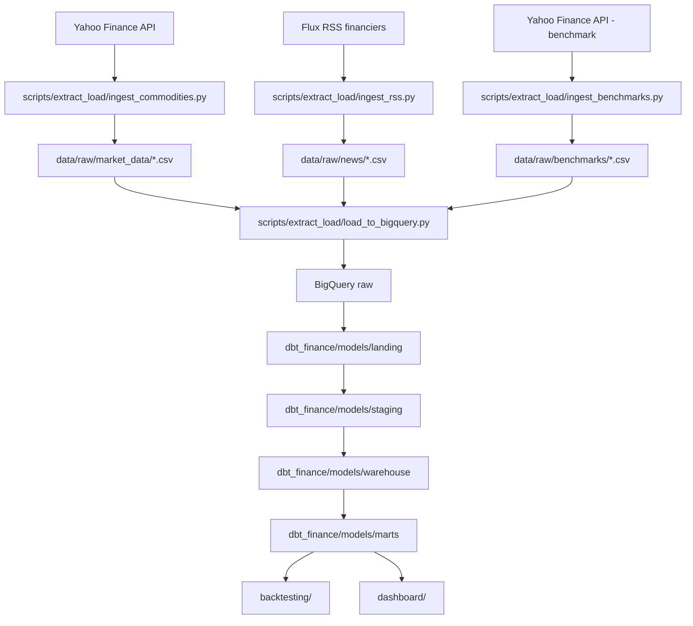

# Flux de la donnée

Ce document explique le trajet de la donnée dans le projet, depuis les sources externes jusqu'au dashboard Streamlit.

L'objectif est d'avoir un pipeline lisible :

```text
Sources externes
→ scripts d'extraction
→ fichiers locaux temporaires
→ BigQuery raw
→ transformations dbt
→ BigQuery marts
→ backtesting et dashboard Streamlit
```

---

## 1. Vue d'ensemble



> Les fichiers CSV dans `data/raw/` servent de zone tampon locale. Ils sont pratiques pour déboguer, rejouer une ingestion et vérifier les données avant chargement. L'arborescence `data/` est suivie via des `.gitkeep`, mais son contenu runtime est ignoré par Git.

---

## 2. Dossiers importants

| Dossier | Rôle |
| --- | --- |
| `config/` | Contient les paramètres du pipeline : tickers, benchmarks, RSS, stratégies. |
| `scripts/extract_load/` | Contient les scripts d'extraction et de chargement des données brutes. |
| `scripts/nlp/` | Contient les scripts d'embeddings, pertinence, sentiment et indicateurs textuels. |
| `data/raw/` | Zone locale temporaire pour les CSV extraits depuis les APIs ; contenu ignoré par Git. |
| `data/processed/` | Zone locale temporaire pour les fichiers nettoyés ou enrichis ; contenu ignoré par Git. |
| `dbt_finance/` | Projet dbt qui transforme les tables BigQuery. |
| `backtesting/` | Moteur de backtesting consommant les tables mart. |
| `dashboard/` | Application Streamlit consommant les tables mart. |
| `logs/` | Logs locaux du pipeline et erreurs ; contenu ignoré par Git. |

---

## 3. Flux données de marché

### 3.1 Configuration

Les matières premières et tickers sont définis dans :

```text
config/commodities.yml
```

Exemple attendu :

```yaml
commodities:
  - symbol: GC=F
    name: Gold Futures
    category: precious_metals
  - symbol: CL=F
    name: Crude Oil WTI Futures
    category: energy
```

### 3.2 Extraction depuis Yahoo Finance

Script responsable :

```text
scripts/extract_load/ingest_commodities.py
```

Rôle du script :

1. lire `config/commodities.yml` ;
2. appeler l'API Yahoo Finance avec `yfinance` ;
3. récupérer les champs OHLCV ;
4. normaliser les noms de colonnes ;
5. ajouter `symbol`, `source` et `ingested_at` ;
6. écrire un CSV local dans `data/raw/market_data/`.

Fichier produit :

```text
data/raw/market_data/market_data_YYYYMMDD.csv
```

Schéma attendu :

```text
symbol
date
open
high
low
close
adjusted_close
volume
source
ingested_at
```

### 3.3 Chargement vers BigQuery

Script responsable :

```text
scripts/extract_load/load_to_bigquery.py
```

Rôle du script :

1. lire le dernier CSV dans `data/raw/market_data/` ;
2. contrôler les colonnes attendues ;
3. supprimer les doublons locaux sur `symbol` + `date` ;
4. charger les lignes dans BigQuery ;
5. éviter les doublons lors d'une relance.

Table BigQuery cible :

```text
raw.market_data_raw
```

---

## 4. Flux benchmarks

### 4.1 Configuration

Les benchmarks sont définis dans :

```text
config/benchmarks.yml
```

Exemple attendu :

```yaml
benchmarks:
  global:
    symbol: DBC
    name: Invesco DB Commodity Index Tracking Fund
  per_commodity_buy_and_hold: true
```

### 4.2 Extraction

Script responsable :

```text
scripts/extract_load/ingest_benchmarks.py
```

Rôle du script :

1. lire `config/benchmarks.yml` ;
2. récupérer le benchmark global via Yahoo Finance ;
3. récupérer les données nécessaires aux comparaisons Buy and Hold ;
4. normaliser les champs ;
5. écrire un CSV local.

Fichier produit :

```text
data/raw/benchmarks/benchmarks_YYYYMMDD.csv
```

### 4.3 Chargement vers BigQuery

Script responsable :

```text
scripts/extract_load/load_to_bigquery.py
```

Table BigQuery cible :

```text
raw.benchmarks_raw
```

---

## 5. Flux actualités RSS

### 5.1 Configuration

Les flux RSS sont définis dans :

```text
config/rss_sources.yml
```

Exemple attendu :

```yaml
rss_sources:
  - name: Investing Commodities
    url: https://example.com/rss/commodities
    category: commodities
```

### 5.2 Extraction RSS

Script responsable :

```text
scripts/extract_load/ingest_rss.py
```

Rôle du script :

1. lire `config/rss_sources.yml` ;
2. appeler chaque flux RSS avec `feedparser` ;
3. récupérer titre, source, URL, date et résumé ;
4. nettoyer le HTML avec BeautifulSoup ;
5. calculer `article_id` et `content_hash` ;
6. supprimer les doublons exacts ;
7. écrire un CSV local.

Fichier produit :

```text
data/raw/news/news_YYYYMMDD.csv
```

Schéma attendu :

```text
article_id
title
source
url
published_at
clean_text
content_hash
ingested_at
```

### 5.3 Chargement vers BigQuery

Script responsable :

```text
scripts/extract_load/load_to_bigquery.py
```

Table BigQuery cible :

```text
raw.news_raw
```

---

## 6. Flux NLP

Les données textuelles chargées dans BigQuery sont ensuite enrichies par les scripts NLP.

### 6.1 Embeddings

Script responsable :

```text
scripts/nlp/create_embeddings.py
```

Entrée :

```text
raw.news_raw
```

Sortie possible :

```text
raw.news_embeddings_raw
```

Rôle du script :

1. lire les articles sans embedding ;
2. générer un vecteur avec le modèle défini dans `.env` ;
3. historiser le modèle et sa version ;
4. éviter de recalculer les embeddings déjà présents.

Schéma attendu :

```text
article_id
embedding
embedding_model
embedding_version
created_at
```

### 6.2 Pertinence article-matière première

Script responsable :

```text
scripts/nlp/compute_relevance.py
```

Entrées :

```text
raw.news_embeddings_raw
config/commodities.yml
```

Sortie possible :

```text
raw.article_commodity_relevance_raw
```

Rôle du script :

1. créer une description de référence par matière première ;
2. générer ou charger son embedding ;
3. comparer chaque article à chaque matière première ;
4. calculer une similarité cosinus ;
5. appliquer un seuil de pertinence.

Schéma attendu :

```text
article_id
commodity_symbol
similarity_score
is_relevant
calculated_at
```

### 6.3 Sentiment et indicateurs textuels

Script responsable :

```text
scripts/nlp/compute_news_indicators.py
```

Entrées :

```text
raw.news_raw
raw.news_embeddings_raw
raw.article_commodity_relevance_raw
```

Sortie possible :

```text
raw.news_features_raw
```

Rôle du script :

1. calculer le sentiment financier ;
2. calculer la nouveauté ;
3. agréger les scores par matière première et par date ;
4. produire les indicateurs textuels consommés par dbt.

Indicateurs attendus :

```text
commodity_symbol
date
news_pressure_score
news_surprise_20d
news_volume
novelty_score
sentiment_dispersion
```

---

## 7. Transformations dbt

Une fois les données chargées dans le dataset `raw`, dbt prépare les tables propres et exploitables.

### 7.1 Landing

Dossier :

```text
dbt_finance/models/landing/
```

Rôle :

- créer des vues simples sur les tables `raw` ;
- ne pas appliquer de logique métier complexe.

Exemples :

```text
landing_market_data.sql
landing_news.sql
landing_benchmarks.sql
```

### 7.2 Staging

Dossier :

```text
dbt_finance/models/staging/
```

Rôle :

- renommer les colonnes ;
- caster les types ;
- dédupliquer ;
- ajouter des contrôles qualité ;
- préparer les données pour les calculs.

Modèles attendus :

```text
stg_commodity_prices
stg_benchmarks
stg_news
stg_pipeline_logs
```

### 7.3 Warehouse

Dossier :

```text
dbt_finance/models/warehouse/
```

Rôle :

- calculer les indicateurs techniques ;
- calculer les indicateurs textuels ;
- construire les signaux de stratégie ;
- préparer les rendements journaliers.

Modèles attendus :

```text
int_technical_indicators
int_article_commodity_relevance
int_commodity_news_features
int_strategy_signals
int_daily_returns
```

### 7.4 Marts

Dossier :

```text
dbt_finance/models/marts/
```

Rôle :

- créer les tables finales utilisées par le backtesting et le dashboard.

Modèles attendus :

```text
mart_strategy_signals
mart_backtest_trades
mart_backtest_daily
mart_strategy_metrics
mart_dashboard_overview
```

---

## 8. Backtesting

Le moteur de backtesting consomme les tables `mart`.

Entrées principales :

```text
mart_strategy_signals
mart_dashboard_overview
mart_commodity_news_features
```

Dossier :

```text
backtesting/
```

Scripts prévus :

```text
backtesting/engine.py
backtesting/portfolio.py
backtesting/costs.py
backtesting/metrics.py
backtesting/strategies/
```

Sorties principales :

```text
mart_backtest_trades
mart_backtest_daily
mart_strategy_metrics
```

Règles importantes :

- un signal calculé à J est exécuté au plus tôt à J+1 ;
- aucune donnée future ne doit être utilisée ;
- les frais et le slippage doivent être intégrés ;
- chaque backtest doit conserver ses paramètres.

---

## 9. Dashboard Streamlit

Le dashboard lit uniquement les tables propres du dataset `mart`.

Dossier :

```text
dashboard/
```

Services :

```text
dashboard/services/bigquery_client.py
dashboard/services/data_loader.py
```

Pages prévues :

```text
dashboard/pages/01_market_overview.py
dashboard/pages/02_indicators.py
dashboard/pages/03_news_indicators.py
dashboard/pages/04_strategy_explorer.py
dashboard/pages/05_backtest.py
dashboard/pages/06_comparison.py
dashboard/pages/07_data_quality.py
```

Flux :

```text
BigQuery mart
→ dashboard/services/data_loader.py
→ pages Streamlit
→ graphiques, filtres et exports CSV
```

---

## 10. Orchestration quotidienne

Script responsable :

```text
scripts/orchestrate.py
```

Ordre d'exécution cible :

```text
1. scripts/extract_load/ingest_commodities.py
2. scripts/extract_load/ingest_benchmarks.py
3. scripts/extract_load/ingest_rss.py
4. scripts/extract_load/load_to_bigquery.py
5. scripts/nlp/create_embeddings.py
6. scripts/nlp/compute_relevance.py
7. scripts/nlp/compute_news_indicators.py
8. dbt run
9. dbt test
10. backtesting/engine.py
11. écriture du statut final du pipeline
```

Chaque étape doit produire un log :

```text
run_id
task_name
start_time
end_time
status
rows_processed
error_message
```

Logs locaux possibles :

```text
logs/pipeline_YYYYMMDD.log
```

Table BigQuery possible :

```text
raw.pipeline_logs_raw
```

---

## 11. Exemple concret de trajet d'une donnée prix

Exemple : prix de clôture de l'or.

```text
1. Le ticker GC=F est défini dans config/commodities.yml.
2. scripts/extract_load/ingest_commodities.py appelle Yahoo Finance.
3. Le script récupère date, open, high, low, close, adjusted_close et volume.
4. Il écrit data/raw/market_data/market_data_20260626.csv.
5. scripts/extract_load/load_to_bigquery.py lit ce CSV.
6. Le loader insère les lignes dans raw.market_data_raw.
7. dbt crée stg_commodity_prices depuis raw.market_data_raw.
8. dbt calcule int_technical_indicators.
9. dbt produit mart_strategy_signals et mart_dashboard_overview.
10. backtesting/engine.py lit mart_strategy_signals pour tester les stratégies.
11. dashboard/pages/01_market_overview.py lit mart_dashboard_overview pour afficher les graphiques.
```

---

## 12. Exemple concret de trajet d'une actualité

Exemple : article RSS sur le pétrole.

```text
1. L'URL du flux RSS est définie dans config/rss_sources.yml.
2. scripts/extract_load/ingest_rss.py lit le flux avec feedparser.
3. Le script extrait title, source, url, published_at et clean_text.
4. Il calcule article_id et content_hash.
5. Il écrit data/raw/news/news_20260626.csv.
6. scripts/extract_load/load_to_bigquery.py charge le CSV dans raw.news_raw.
7. scripts/nlp/create_embeddings.py génère l'embedding de l'article.
8. scripts/nlp/compute_relevance.py compare l'article aux matières premières.
9. scripts/nlp/compute_news_indicators.py calcule sentiment, nouveauté et news_pressure_score.
10. dbt prépare int_commodity_news_features.
11. dbt alimente mart_strategy_signals et mart_dashboard_overview.
12. La stratégie technical_news_filter utilise le signal textuel.
13. dashboard/pages/03_news_indicators.py affiche la pression des actualités.
```

---

## 13. Convention de nommage proposée

Fichiers locaux :

```text
data/raw/market_data/market_data_YYYYMMDD.csv
data/raw/benchmarks/benchmarks_YYYYMMDD.csv
data/raw/news/news_YYYYMMDD.csv
data/processed/news_embeddings/news_embeddings_YYYYMMDD.parquet
logs/pipeline_YYYYMMDD.log
```

Tables BigQuery brutes :

```text
raw.market_data_raw
raw.benchmarks_raw
raw.news_raw
raw.news_embeddings_raw
raw.article_commodity_relevance_raw
raw.news_features_raw
raw.pipeline_logs_raw
```

Tables BigQuery finales :

```text
mart.mart_strategy_signals
mart.mart_backtest_trades
mart.mart_backtest_daily
mart.mart_strategy_metrics
mart.mart_dashboard_overview
```

---

## 14. Points à décider plus tard

Ces éléments dépendent de l'étape 0 de cadrage :

- liste finale des matières premières ;
- tickers Yahoo Finance ;
- benchmark global ;
- sources RSS ;
- date de début définitive : `2020-01-01` ou historique plus ancien ;
- seuil de pertinence RSS ;
- modèle exact de sentiment financier.
