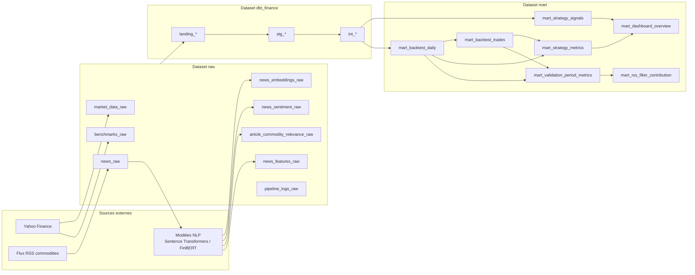
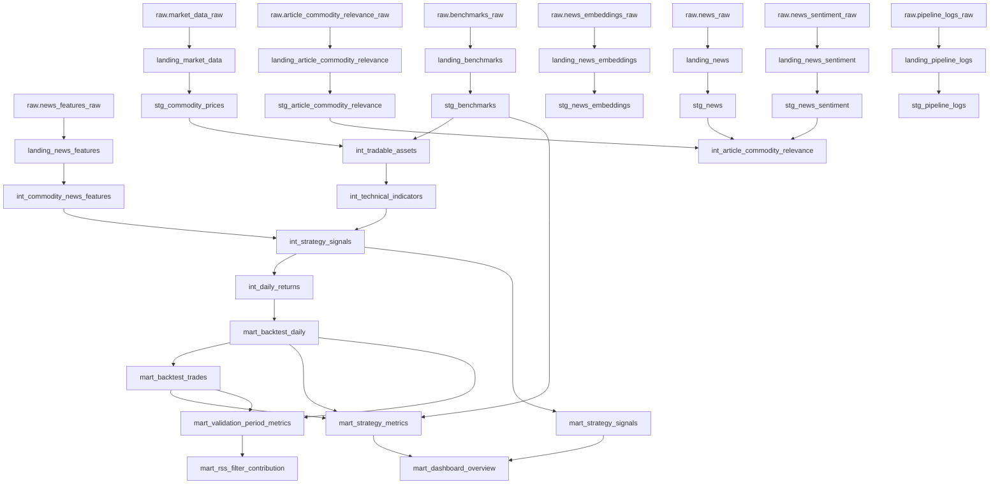
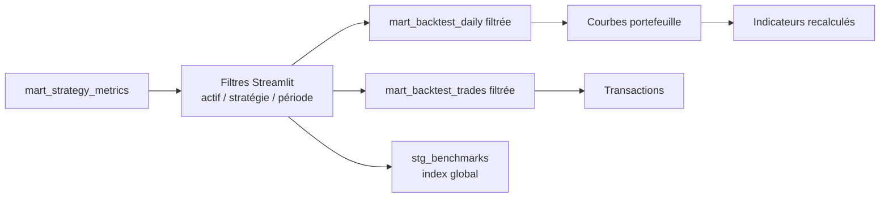
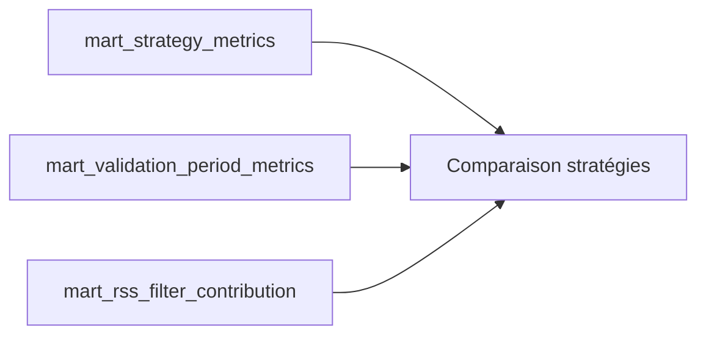

# Documentation technique — Schéma de base de données

Ce document décrit le schéma BigQuery du projet ELT Commodities & Backtesting.

Il complète :

- `docs/architecture_globale.md` pour la vue système ;
- `docs/flux_donnee.md` pour le trajet fonctionnel de la donnée ;
- `docs/strategies_backtesting.md` pour la logique métier des stratégies.

La base est organisée en trois datasets BigQuery principaux :

```text
raw
dbt_finance
mart
```

---

## 1. Vue d'ensemble des datasets



---

## 2. Rôle des datasets

### `raw`

Zone d'atterrissage des données écrites par les scripts Python.

Les données y sont proches des sources :

- prix Yahoo Finance ;
- benchmarks synthétiques ;
- articles RSS ;
- embeddings ;
- scores FinBERT ;
- pertinence article / matière première ;
- indicateurs news agrégés ;
- logs pipeline.

Les tables `raw` sont créées par :

```bash
make dbt-ensure-raw
```

Elles sont alimentées par :

```bash
make ingest
make nlp
```

---

### `dbt_finance`

Zone de transformation dbt.

Elle contient trois familles de modèles :

| Couche | Préfixe | Rôle |
| --- | --- | --- |
| Landing | `landing_*` | Projection directe des sources `raw`. |
| Staging | `stg_*` | Typage, nettoyage, déduplication. |
| Warehouse | `int_*` | Jointures métier, indicateurs, signaux, rendements. |

---

### `mart`

Zone finale consommée par le dashboard Streamlit.

Elle contient :

- les signaux de stratégie ;
- les rendements journaliers backtestés ;
- les transactions ;
- les métriques agrégées ;
- les métriques par période ;
- la contribution du filtre RSS ;
- la table de synthèse dashboard.

---

## 3. Graphe technique dbt



---

## 4. Schéma relationnel métier

Ce diagramme ne liste pas toutes les colonnes techniques, mais les clés et champs principaux utiles pour comprendre les relations.

```mermaid
erDiagram
    MARKET_DATA_RAW {
        DATE date PK
        STRING symbol PK
        STRING commodity_id
        STRING commodity_name
        STRING category
        FLOAT open
        FLOAT high
        FLOAT low
        FLOAT close
        FLOAT volume
        TIMESTAMP ingested_at
    }

    BENCHMARKS_RAW {
        DATE date PK
        STRING benchmark_id PK
        STRING benchmark_type
        STRING component_id
        STRING component_symbol
        FLOAT close_price
        FLOAT benchmark_level
        FLOAT daily_return
        FLOAT target_weight
        TIMESTAMP ingested_at
    }

    NEWS_RAW {
        STRING article_id PK
        STRING source_id
        STRING feed_id
        STRING title
        STRING canonical_url
        TIMESTAMP published_at
        STRING clean_text
        STRING content_hash
        TIMESTAMP fetched_at
        TIMESTAMP ingested_at
    }

    NEWS_SENTIMENT_RAW {
        STRING article_id PK
        FLOAT positive_probability
        FLOAT neutral_probability
        FLOAT negative_probability
        FLOAT sentiment_score
        FLOAT novelty_score
        STRING sentiment_model
        TIMESTAMP calculated_at
    }

    ARTICLE_COMMODITY_RELEVANCE_RAW {
        STRING article_id PK
        STRING commodity_id PK
        FLOAT relevance_score
        BOOL is_relevant
        STRING embedding_model
        TIMESTAMP calculated_at
    }

    NEWS_FEATURES_RAW {
        DATE date PK
        STRING commodity_id PK
        FLOAT weighted_sentiment_score
        FLOAT news_pressure_score
        FLOAT news_acceleration
        FLOAT geopolitical_risk_score
        FLOAT supply_shock_score
        FLOAT weather_risk_score
        TIMESTAMP calculated_at
    }

    INT_TRADABLE_ASSETS {
        DATE date PK
        STRING symbol PK
        STRING commodity_id
        STRING commodity_name
        STRING category
        FLOAT close
        FLOAT volume
        STRING source
    }

    INT_TECHNICAL_INDICATORS {
        DATE date PK
        STRING symbol PK
        FLOAT close
        FLOAT simple_return
        FLOAT sma_20
        FLOAT sma_50
        FLOAT rsi_14
        FLOAT stochastic_rsi_k
        FLOAT stochastic_rsi_d
        FLOAT previous_high_20d
        FLOAT previous_low_10d
        FLOAT volatility_20d
    }

    INT_COMMODITY_NEWS_FEATURES {
        DATE date PK
        STRING commodity_id PK
        FLOAT weighted_sentiment_score
        FLOAT news_pressure_score
        FLOAT news_acceleration
        FLOAT geopolitical_risk_score
        FLOAT supply_shock_score
    }

    INT_STRATEGY_SIGNALS {
        DATE date PK
        STRING symbol PK
        STRING strategy_name PK
        STRING commodity_id
        FLOAT close
        INT signal
        FLOAT weighted_sentiment_score
        FLOAT geopolitical_risk_score
        FLOAT supply_shock_score
    }

    INT_DAILY_RETURNS {
        DATE date PK
        STRING symbol PK
        STRING strategy_name PK
        FLOAT asset_return
        INT signal
        INT executed_position
        FLOAT strategy_return
    }

    MART_BACKTEST_DAILY {
        DATE date PK
        STRING symbol PK
        STRING strategy_name PK
        FLOAT strategy_return
        FLOAT net_strategy_return
        FLOAT cumulative_strategy_return
        FLOAT cumulative_asset_return
        FLOAT estimated_transaction_cost_rate
    }

    MART_BACKTEST_TRADES {
        DATE trade_date PK
        STRING symbol PK
        STRING strategy_name PK
        FLOAT trade_price
        INT previous_position
        INT executed_position
        INT position_delta
        STRING trade_type
        FLOAT estimated_transaction_cost_rate
    }

    MART_STRATEGY_METRICS {
        STRING symbol PK
        STRING strategy_name PK
        DATE start_date
        DATE end_date
        FLOAT cumulative_return
        FLOAT annualized_return
        FLOAT sharpe_ratio
        FLOAT max_drawdown
        FLOAT win_rate
        INT trade_count
        FLOAT outperformance_vs_buy_hold
        FLOAT outperformance_vs_global_benchmark
    }

    MART_VALIDATION_PERIOD_METRICS {
        STRING validation_period PK
        STRING symbol PK
        STRING strategy_name PK
        DATE start_date
        DATE end_date
        FLOAT cumulative_return
        FLOAT sharpe_ratio
        FLOAT max_drawdown
        FLOAT robust_selection_score
        BOOL is_optimization_allowed
    }

    MART_DASHBOARD_OVERVIEW {
        STRING symbol PK
        DATE latest_date
        FLOAT latest_close
        STRING strategy_name
        FLOAT cumulative_return
        FLOAT sharpe_ratio
        FLOAT max_drawdown
        INT trade_count
    }

    MARKET_DATA_RAW ||--o{ INT_TRADABLE_ASSETS : "symbol + date"
    BENCHMARKS_RAW ||--o{ INT_TRADABLE_ASSETS : "synthetic index"
    INT_TRADABLE_ASSETS ||--|| INT_TECHNICAL_INDICATORS : "symbol + date"
    NEWS_RAW ||--o{ NEWS_SENTIMENT_RAW : "article_id"
    NEWS_RAW ||--o{ ARTICLE_COMMODITY_RELEVANCE_RAW : "article_id"
    NEWS_SENTIMENT_RAW ||--o{ ARTICLE_COMMODITY_RELEVANCE_RAW : "article_id"
    NEWS_FEATURES_RAW ||--o{ INT_COMMODITY_NEWS_FEATURES : "commodity_id + date"
    INT_TECHNICAL_INDICATORS ||--o{ INT_STRATEGY_SIGNALS : "symbol + date"
    INT_COMMODITY_NEWS_FEATURES ||--o{ INT_STRATEGY_SIGNALS : "commodity_id + date"
    INT_STRATEGY_SIGNALS ||--o{ INT_DAILY_RETURNS : "strategy + symbol + date"
    INT_DAILY_RETURNS ||--o{ MART_BACKTEST_DAILY : "strategy + symbol + date"
    MART_BACKTEST_DAILY ||--o{ MART_BACKTEST_TRADES : "position changes"
    MART_BACKTEST_DAILY ||--o{ MART_STRATEGY_METRICS : "aggregation"
    MART_BACKTEST_TRADES ||--o{ MART_STRATEGY_METRICS : "trade metrics"
    MART_BACKTEST_DAILY ||--o{ MART_VALIDATION_PERIOD_METRICS : "period aggregation"
    MART_BACKTEST_TRADES ||--o{ MART_VALIDATION_PERIOD_METRICS : "period trade metrics"
    MART_STRATEGY_METRICS ||--o{ MART_DASHBOARD_OVERVIEW : "latest overview"
```



---

## 5. Tables `raw`

| Table | Grain | Clé logique | Alimentation |
| --- | --- | --- | --- |
| `raw.market_data_raw` | 1 ligne par actif / date | `symbol`, `date` | `scripts/extract_load/ingest_commodities.py` |
| `raw.benchmarks_raw` | 1 ligne par benchmark / composant / date | `benchmark_id`, `component_id`, `date` | `scripts/extract_load/ingest_benchmarks.py` |
| `raw.news_raw` | 1 ligne par article RSS | `article_id` | `scripts/extract_load/ingest_rss.py` |
| `raw.news_embeddings_raw` | 1 embedding par article / modèle | `article_id`, `embedding_model` | `scripts/nlp/create_embeddings.py` |
| `raw.news_sentiment_raw` | 1 score sentiment par article / modèle | `article_id`, `sentiment_model` | `scripts/nlp/compute_sentiment.py` |
| `raw.article_commodity_relevance_raw` | 1 score par article / commodity | `article_id`, `commodity_id` | `scripts/nlp/compute_relevance.py` |
| `raw.news_features_raw` | 1 ligne par commodity / date | `commodity_id`, `date` | `scripts/nlp/compute_news_indicators.py` |
| `raw.pipeline_logs_raw` | 1 ligne par tâche pipeline | `run_id`, `task_name` | `scripts/orchestrate.py` |

---

## 6. Modèles `landing`

Les modèles `landing_*` sont des vues dbt très proches des sources.

Ils servent surtout à :

- isoler la dépendance à `source('raw', ...)` ;
- fournir un point d'entrée standard aux modèles staging ;
- faciliter la lecture du DAG dbt.

| Modèle landing | Source raw |
| --- | --- |
| `landing_market_data` | `raw.market_data_raw` |
| `landing_benchmarks` | `raw.benchmarks_raw` |
| `landing_news` | `raw.news_raw` |
| `landing_news_embeddings` | `raw.news_embeddings_raw` |
| `landing_news_sentiment` | `raw.news_sentiment_raw` |
| `landing_article_commodity_relevance` | `raw.article_commodity_relevance_raw` |
| `landing_news_features` | `raw.news_features_raw` |
| `landing_pipeline_logs` | `raw.pipeline_logs_raw` |

---

## 7. Modèles `staging`

| Modèle staging | Rôle principal | Tests principaux |
| --- | --- | --- |
| `stg_commodity_prices` | Prix typés et dédupliqués. | unicité `symbol`, `date`; `close` non nul |
| `stg_benchmarks` | Benchmarks typés. | `benchmark_id`, `date` non nuls |
| `stg_news` | Articles RSS nettoyés et dédupliqués. | `article_id` unique; `published_at` non nul |
| `stg_news_embeddings` | Embeddings typés. | dépendance NLP |
| `stg_news_sentiment` | Scores sentiment typés. | `article_id`, `sentiment_score` non nuls |
| `stg_article_commodity_relevance` | Pertinence article / commodity typée. | `article_id`, `commodity_id` non nuls |
| `stg_pipeline_logs` | Logs pipeline typés. | `run_id`, `task_name` non nuls |

---

## 8. Modèles `warehouse`

### `int_tradable_assets`

Construit l'univers backtestable.

Sources :

- `stg_commodity_prices` pour les actifs commodities ;
- `stg_benchmarks` pour l'actif synthétique `COMMODITY_INDEX`.

Grain :

```text
symbol + date
```

---

### `int_technical_indicators`

Ajoute les indicateurs techniques sans look-ahead :

- rendements simples et logarithmiques ;
- SMA 20 / 50 / 100 / 200 ;
- Bollinger Bands ;
- RSI 14 ;
- Stochastic RSI ;
- MACD ;
- ATR ;
- volatilité historique ;
- plus haut précédent 20 jours pour l'entrée breakout ;
- plus bas précédent 10 jours pour la sortie breakout.

Grain :

```text
symbol + date
```

---

### `int_commodity_news_features`

Prépare les indicateurs textuels journaliers :

- `weighted_sentiment_score` ;
- `news_pressure_score` ;
- `news_acceleration` ;
- `geopolitical_risk_score` ;
- `supply_shock_score` ;
- `weather_risk_score`.

Grain :

```text
commodity_id + date
```

---

### `int_strategy_signals`

Calcule les signaux des stratégies :

- `buy_and_hold` ;
- `moving_average_cross` ;
- `moving_average_stoch_rsi` ;
- `technical_news_filter` ;
- `breakout_20d`.

Grain :

```text
strategy_name + symbol + date
```

Valeurs possibles de `signal` :

```text
-1, 0, 1
```

Dans le projet actuel, les stratégies sont surtout long / flat :

```text
0 = flat
1 = long
```

---

### `int_daily_returns`

Transforme les signaux en rendements exécutés.

Point méthodologique important :

```text
signal produit à J
position exécutée à J+1
```

Cela évite le look-ahead bias.

Grain :

```text
strategy_name + symbol + date
```

---

## 9. Tables `mart`

### `mart_strategy_signals`

Table finale des signaux exposés au dashboard.

Elle reprend `int_strategy_signals` avec les champs nécessaires à l'analyse et à l'affichage.

---

### `mart_backtest_daily`

Série journalière de performance.

Elle contient :

- rendement brut stratégie ;
- coût estimé ;
- rendement net ;
- rendement cumulé stratégie ;
- rendement cumulé buy and hold ;
- position précédente et position exécutée.

Grain :

```text
strategy_name + symbol + date
```

---

### `mart_backtest_trades`

Événements de changement de position.

Types de transaction :

```text
open
close
rebalance
```

Grain logique :

```text
strategy_name + symbol + trade_date + trade_type
```

---

### `mart_strategy_metrics`

Métriques agrégées par stratégie et actif.

Principales colonnes :

- `cumulative_return` ;
- `annualized_return` ;
- `annualized_volatility` ;
- `sharpe_ratio` ;
- `sortino_ratio` ;
- `max_drawdown` ;
- `calmar_ratio` ;
- `win_rate` ;
- `profit_factor` ;
- `trade_count` ;
- `outperformance_vs_buy_hold` ;
- `outperformance_vs_global_benchmark`.

Grain :

```text
strategy_name + symbol
```

---

### `mart_validation_period_metrics`

Découpe les métriques en périodes :

```text
calibration
validation
test
```

Elle permet de distinguer :

- la période où l'on peut choisir ou calibrer ;
- la période de validation ;
- la période finale qui ne doit pas servir à optimiser.

Grain :

```text
validation_period + strategy_name + symbol
```

---

### `mart_rss_filter_contribution`

Compare :

```text
technical_news_filter
vs
moving_average_cross
```

Objectif :

```text
mesurer si le filtre RSS / NLP ajoute réellement de la valeur
par rapport à une stratégie technique seule.
```

Grain :

```text
validation_period + symbol
```

---

### `mart_dashboard_overview`

Table de synthèse lue par Streamlit.

Elle agrège :

- dernier prix ;
- dernier signal ;
- métriques principales ;
- volume news ;
- pression news ;
- sentiment pondéré.

Grain :

```text
symbol + strategy_name
```

---

## 10. Chemins critiques de lecture

### Dashboard Backtest



---

### Dashboard Comparaison



---

## 11. Règles de qualité dbt

Les tests dbt sécurisent principalement :

| Type | Exemples |
| --- | --- |
| Unicité | `symbol + date`, `strategy_name + symbol + date` |
| Non-nullité | prix, dates, signaux, articles |
| Valeurs acceptées | `signal in (-1, 0, 1)`, périodes de validation |
| Cohérence métier | OHLC, dates futures, fraîcheur marché |
| Anti-duplication | articles RSS et signaux |

Commande :

```bash
make dbt-test
```

ou reconstruction complète :

```bash
make dbt-build
```

---

## 12. Résumé

Le schéma suit une logique ELT classique :

```text
raw
→ landing
→ staging
→ warehouse
→ mart
→ dashboard
```

Les tables critiques pour le produit final sont :

```text
mart.mart_backtest_daily
mart.mart_backtest_trades
mart.mart_strategy_metrics
mart.mart_validation_period_metrics
mart.mart_rss_filter_contribution
mart.mart_dashboard_overview
```

Les clés métier les plus importantes sont :

```text
symbol + date
strategy_name + symbol + date
commodity_id + date
article_id
validation_period + strategy_name + symbol
```
